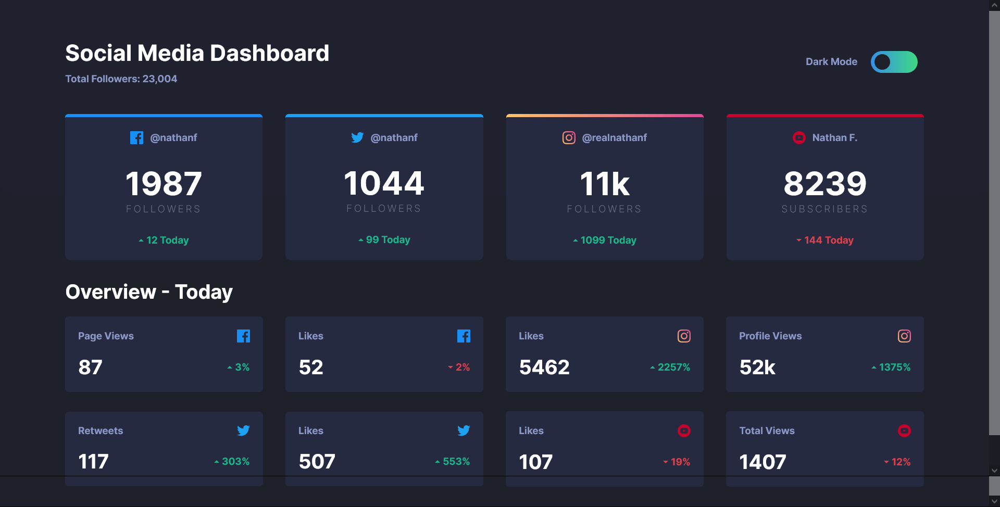

# Frontend Mentor - Social media dashboard with theme switcher solution

This is a solution to the [Social media dashboard with theme switcher challenge on Frontend Mentor](https://www.frontendmentor.io/challenges/social-media-dashboard-with-theme-switcher-6oY8ozp_H). Frontend Mentor challenges help you improve your coding skills by building realistic projects.

## The challenge

Users should be able to:

- View the optimal layout for the site depending on their device's screen size
- See hover states for all interactive elements on the page
- Toggle color theme to their preference

### Links

- [Solution URL](https://www.frontendmentor.io/solutions/social-media-dashboard-with-theme-switcher-oXOQ5pVJf)
- [Live Site URL](https://social-media-dashboard-developingweb.vercel.app)

## Built with

- Semantic HTML5 markup
- CSS custom properties
- Flexbox
- Mobile-first workflow

## Author

- Frontend Mentor - [@developingWeb](https://www.frontendmentor.io/profile/developingWeb)
